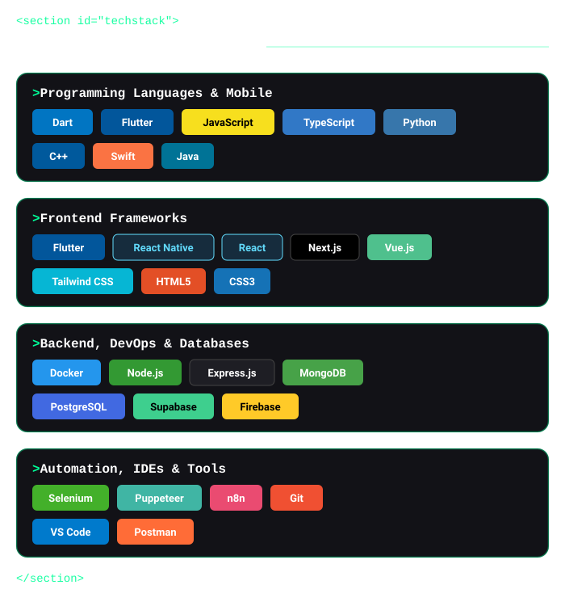

  

  

 

<!-- Portfolio Screenshot Containers -->

  

 

  

 

---

## Connect 

<table width="100%">
  <tr>
    <td align="center" width="25%"></td>
    <td align="center" width="25%"></td>
    <td align="center" width="25%"></td>
    <td align="center" width="25%"></td>
  </tr>
  <tr>
    <td align="center" width="25%"></td>
    <td align="center" width="25%"></td>
    <td align="center" width="25%"></td>
    <td align="center" width="25%"></td>
  </tr>
</table>

---

## Tech Stack & Ecosystem

  

---

## GitHub Analytics

    
    
  

---

## Certifications 

  

---

  
<strong>Enjoying my projects? Your support fuels innovation!</strong>

  
  

---

  
    
  

    <strong>Building the future, one line of code at a time</strong>
  

  
  

    
    
    
  

  
  
© 2026 Touhidur Rahman (dev.isTuhin) - Crafted with passion and precision

