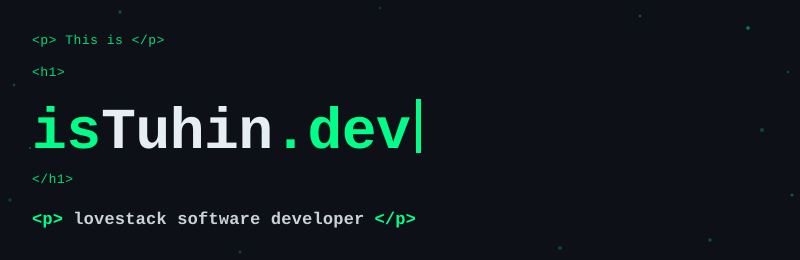
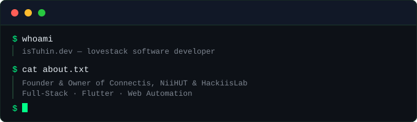

  

  

 

<!-- Portfolio Screenshot Containers -->

  

 

  

 

---

## 🚀 About Me

  <h2>👨‍💻 Touhidur Rahman</h2>
  
<strong>Founder &amp; Owner of Connectis, HackiisLab &amp; Niihut</strong>

  
<em>Full-Stack Developer | Flutter &amp; Mobile Specialist | Web Automation Expert</em>

  
  

    
    
  

### 🎯 Quick Highlights
- ⚡ **Core Focus:** Flutter, React Native, Full-Stack Development & Web Automation
- 💼 **Ventures:** Founder &amp; Owner of **Connectis**, **HackiisLab** &amp; **Niihut**
- 🌐 **Portfolio:** [devistuhin.vercel.app](https://devistuhin.vercel.app/)
- 🧹 **Philosophy:** Clean Code, High Performance & User-Centric Design
- ☕ **Fuel:** Coffee &amp; Night Owl Productivity

---

## 🌐 Connect & Collaborate

### 📱 Professional Networks

### 💻 Contact & Socials

---

## ⚡ Tech Stack & Ecosystem

### 💻 Programming Languages & Mobile

### ⚡ Backend, DevOps & Databases

### 🎨 Frontend Frameworks

### 🛠️ Automation, IDEs & Tools

---

## 📊 GitHub Analytics & Performance

    
    
  

---

## 🏆 Badges & Certifications 

  

---

## ☕ Support My Journey

  
<strong>💖 Enjoying my projects? Your support fuels innovation!</strong>

  
  

---

  
  
  <h3>✨ "Where Silence Meets Syntax – Welcome to My Digital Playground" ✨</h3>
  
  

    <strong>Building the future, one line of code at a time</strong>
  

  
  

    
    
    
  

  
  
© 2026 Touhidur Rahman (dev.isTuhin) - Crafted with passion and precision

